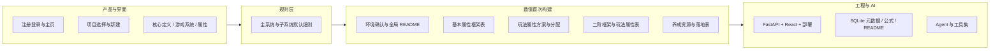

# 游戏数值系统 AI 化自动开发 — 引导与索引

## 本文档作用

本套文档描述一个 **以 Web 为载体** 的游戏数值设计工具：支持配置驱动、AI Agent 填表与人工审核，覆盖从「账号与项目」到「数值表落地」的完整链路。

**阅读顺序（建议）**

1. 先读本引导，确认目标与文档地图。
2. 做 **产品 / 交互需求** 时读 `01`。
3. 做 **默认数值与系统规则** 时读 `02`。
4. 做 **首次数值建模流水线** 时严格按 `03` 的步骤执行。
5. 做 **工程落地** 时：先读 `04`（前后端与部署），再读 `05`（数据与公式领域模型），最后读 `06`（Agent 与工具）。

---

## 端到端工作流（鸟瞰）

- **配置侧**：用户在界面完成核心定义、系统树、属性勾选（见 `01`）；细则提供缺省行为（见 `02`）。
- **数值侧**：AI/工具按 `03` 的顺序产出表与文档，不得随意跳步。
- **实现侧**：**FastAPI + React + SQLite**（见 `04`、`05`）；Agent 双角色与工具约束（见 `06`）。

---

## 文档地图

| 文档 | 内容概要 | 主要读者 |
|------|----------|----------|
| [游戏数值系统AI化自动开发-01-产品与界面需求.md](./游戏数值系统AI化自动开发-01-产品与界面需求.md) | Web 载体、登录注册、项目流、新建项目三页签（核心定义 / 游戏系统 / 属性系统） | 产品、前端、测试 |
| [游戏数值系统AI化自动开发-02-系统与子系统默认细则.md](./游戏数值系统AI化自动开发-02-系统与子系统默认细则.md) | 各主系统开放等级与默认投放逻辑；子系统（宝石、增幅、技能强度等）默认规则 | 数值策划、Agent 规则上下文 |
| [游戏数值系统AI化自动开发-03-数值模型首次构建流程.md](./游戏数值系统AI化自动开发-03-数值模型首次构建流程.md) | 从全局 README 到玩法落地表的 **顺序化执行手册** | 数值、AI 执行初始化流水线 |
| [游戏数值系统AI化自动开发-04-前后端框架与部署.md](./游戏数值系统AI化自动开发-04-前后端框架与部署.md) | 选型思路、FastAPI 路由分组、React 三面板、系统 SQLite 表、Nginx/systemd、Token 与目录布局 | 全栈、运维 |
| [游戏数值系统AI化自动开发-05-数据层与计算设计.md](./游戏数值系统AI化自动开发-05-数据层与计算设计.md) | 数据/算法/Agent 分层、固定层与动态层、README、公式与 @API、算法 API 准则、工具集概述与增量调度 | 后端、数值工程 |
| [游戏数值系统AI化自动开发-06-Agent流程与工具集.md](./游戏数值系统AI化自动开发-06-Agent流程与工具集.md) | 初始化 / 维护 Agent 五阶段与五步循环、提示词四区块原则、各工具名与统一返回值 | Agent 工程、提示词维护 |

---

## 与原拆分结构的关系

当前为 **1 份引导 + 6 份执行文档**（在「产品与数值」`01`～`03` 不变的前提下，将原「技术架构」拆成 **`04` 运行框架** 与 **`05` 数据/计算模型**，Agent 顺延为 **`06`**）。

入口指针文件：[游戏数值系统AI化自动开发.md](./游戏数值系统AI化自动开发.md)

---

## 执行时的硬约束（摘要）

- **数值首次构建**：必须按 `03` 文档内章节顺序推进；全局 README 与表级 README 与表数据同步维护。
- **Agent**：初始化五阶段不可跳步；维护遵循「理解—定界—执行—验证—记录」；不覆盖用户手动单元格。
- **分配表**：玩法属性分配、养成资源分配 **不要求** 行或列求和为 100%。

更细的条文请在对应执行文档中查阅。
